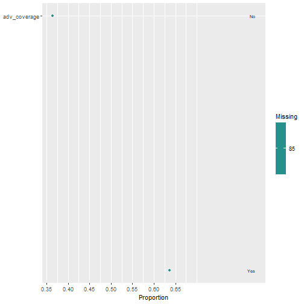
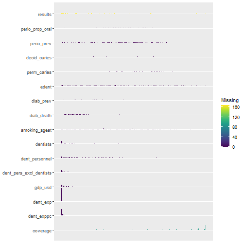
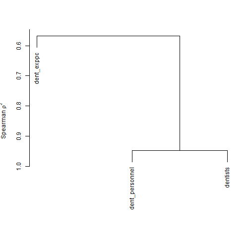
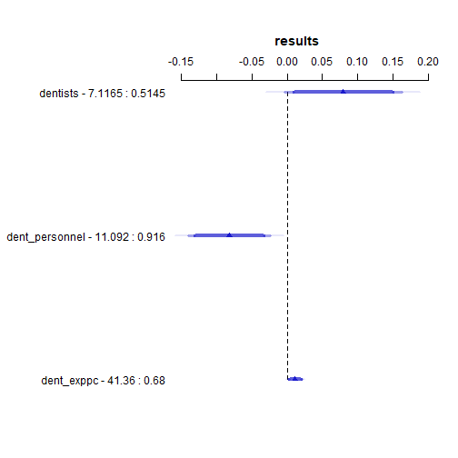
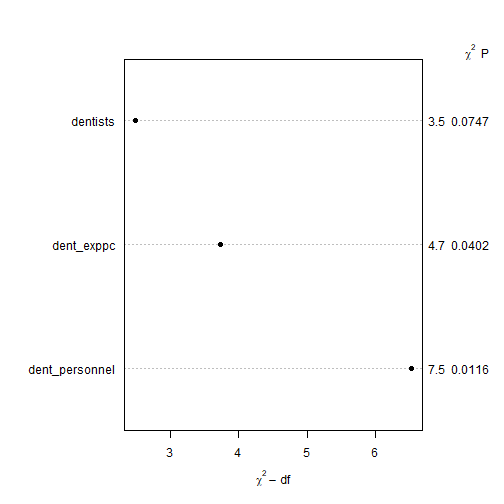
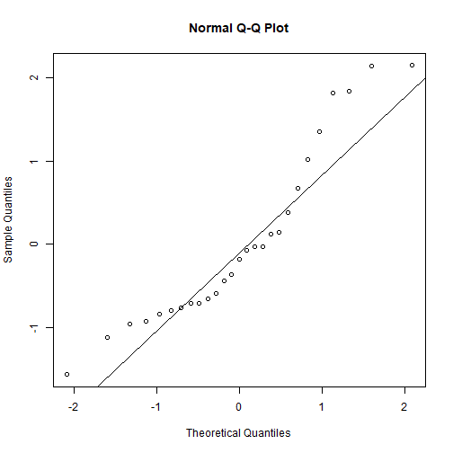
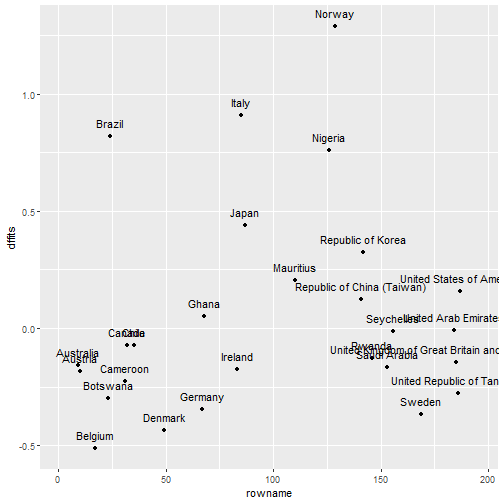
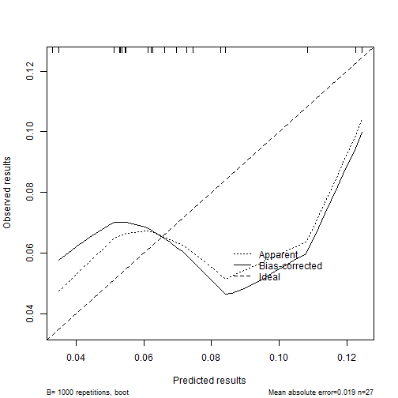

``` r
#This file aims to predict the proportion of dental expenditure spent on periodontitis. This is reported for 
#only 26 countries and unreported for the other 172 countries
#This proportion above is saved as results in the csv

#renv related commands for my convenience
#renv::init()
#renv::install("cowplot")
#renv::status()
#renv::snapshot(type = "all")
#renv::restore() 
```

1. Importing data into R


``` r
GBD <- readr::read_csv("GBD.csv",
                       col_names = TRUE,
                       show_col_types = TRUE,
                       col_types = list(
                         "direct" = readr::col_factor(),
                         "adv_coverage" = readr::col_factor()
                       )
) 
```

```
## Rows: 195 Columns: 43
## ── Column specification ──────────────────────────────────────────────────────────────────────────────
## Delimiter: ","
## chr  (1): rowname
## dbl (40): results, perio_prop_oral, u_perio_prop_oral, l_perio_prop_oral, perio_prev, u_perio_prev...
## fct  (2): direct, adv_coverage
## 
## ℹ Use `spec()` to retrieve the full column specification for this data.
## ℹ Specify the column types or set `show_col_types = FALSE` to quiet this message.
```

``` r
#Setting up data distribution to facilitate prediction after regression
dd <- rms::datadist(GBD)
options(datadist = "dd")
```

2. Descriptive statistics for data


``` r
d <- GBD %>% select(rowname,results,perio_prop_oral,perio_prev, decid_caries,perm_caries, 
                    edent, diab_prev, diab_death, smoking_agest, dentists, dent_personnel,
                    dent_pers_excl_dentists, gdp_usd, dent_exp, 
                    dent_exppc,           #selecting only mean predictor values, excluding upper/lower CIs
                    adv_coverage, coverage) %>% 
  Hmisc::describe()

d
```

```
## . 
## 
##  18  Variables      195  Observations
## ------------------------------------------------------------------------------------------------------
## rowname 
##        n  missing distinct 
##      195        0      195 
## 
## lowest : Afghanistan                        Albania                            Algeria                            Andorra                            Angola                            
## highest: Venezuela (Bolivarian Republic of) Viet Nam                           Yemen                              Zambia                             Zimbabwe                          
## ------------------------------------------------------------------------------------------------------
## results 
##        n  missing distinct     Info     Mean  pMedian      Gmd      .05      .10      .25      .50 
##       27      168       27        1  0.07511  0.06225  0.07681 0.006360 0.008344 0.024000 0.055900 
##      .75      .90      .95 
## 0.097750 0.172800 0.232800 
## 
## lowest : 0.005    0.006    0.0072   0.009107 0.0127  , highest: 0.1319   0.172    0.174    0.258    0.2756  
## ------------------------------------------------------------------------------------------------------
## perio_prop_oral 
##        n  missing distinct     Info     Mean  pMedian      Gmd      .05      .10      .25      .50 
##      195        0      195        1   0.2032   0.2038  0.09705  0.04647  0.08614  0.15117  0.20507 
##      .75      .90      .95 
##  0.26246  0.30603  0.33428 
## 
## lowest : 0.0246973 0.0264815 0.0265153 0.0277387 0.0326812, highest: 0.384743  0.404108  0.407337  0.43398   0.450044 
## ------------------------------------------------------------------------------------------------------
## perio_prev 
##        n  missing distinct     Info     Mean  pMedian      Gmd      .05      .10      .25      .50 
##      195        0      195        1    0.122    0.123  0.06414  0.02380  0.03972  0.07920  0.13011 
##      .75      .90      .95 
##  0.16173  0.19264  0.20534 
## 
## lowest : 0.0133261 0.0143777 0.0145758 0.0147082 0.0177658, highest: 0.214542  0.217344  0.243632  0.260842  0.282404 
## ------------------------------------------------------------------------------------------------------
## decid_caries 
##        n  missing distinct     Info     Mean  pMedian      Gmd      .05      .10      .25      .50 
##      195        0      195        1  0.07046  0.06994  0.03314  0.02631  0.03176  0.04841  0.06880 
##      .75      .90      .95 
##  0.09322  0.11170  0.11983 
## 
## lowest : 0.0165941 0.0170189 0.0188965 0.0199384 0.022854 , highest: 0.124178  0.124234  0.13133   0.133387  0.142499 
## ------------------------------------------------------------------------------------------------------
## perm_caries 
##        n  missing distinct     Info     Mean  pMedian      Gmd      .05      .10      .25      .50 
##      195        0      195        1   0.3469   0.3498  0.08378   0.2174   0.2499   0.2911   0.3575 
##      .75      .90      .95 
##   0.4023   0.4321   0.4490 
## 
## lowest : 0.107093 0.142757 0.155737 0.175086 0.181074, highest: 0.463833 0.465106 0.474381 0.492254 0.54382 
## ------------------------------------------------------------------------------------------------------
## edent 
##        n  missing distinct     Info     Mean  pMedian      Gmd      .05      .10      .25      .50 
##      195        0      195        1   0.0515  0.05062  0.03709 0.009651 0.011951 0.021779 0.047003 
##      .75      .90      .95 
## 0.077387 0.098194 0.107761 
## 
## lowest : 0.00812654 0.00819724 0.00883622 0.00883941 0.00893028
## highest: 0.114783   0.119688   0.123598   0.126737   0.131594  
## ------------------------------------------------------------------------------------------------------
## diab_prev 
##        n  missing distinct     Info     Mean  pMedian      Gmd      .05      .10      .25      .50 
##      195        0      195        1  0.07738  0.07432  0.04908  0.01819  0.02498  0.04153  0.07097 
##      .75      .90      .95 
##  0.10168  0.13344  0.15447 
## 
## lowest : 0.0112518 0.0122281 0.0137692 0.0142094 0.0144303, highest: 0.184846  0.191276  0.228553  0.232312  0.257963 
## ------------------------------------------------------------------------------------------------------
## diab_death 
##        n  missing distinct     Info     Mean  pMedian      Gmd      .05      .10      .25      .50 
##      195        0      195        1  0.03605  0.02894  0.02934 0.009371 0.012309 0.017942 0.025110 
##      .75      .90      .95 
## 0.041471 0.079080 0.099569 
## 
## lowest : 0.00330044 0.00440695 0.00704668 0.00709424 0.00723848
## highest: 0.121534   0.130709   0.145946   0.176395   0.193711  
## ------------------------------------------------------------------------------------------------------
## smoking_agest 
##        n  missing distinct     Info     Mean  pMedian      Gmd      .05      .10      .25      .50 
##      195        0      195        1   0.2449   0.2385   0.1531  0.06654  0.08643  0.12888  0.21920 
##      .75      .90      .95 
##  0.34171  0.42931  0.47071 
## 
## lowest : 0.0408216 0.045308  0.0477156 0.0588538 0.0595755, highest: 0.521582  0.583269  0.622407  0.63827   0.646349 
## ------------------------------------------------------------------------------------------------------
## dentists 
##        n  missing distinct     Info     Mean  pMedian      Gmd      .05      .10      .25      .50 
##      195        0      192        1    4.259    3.899    4.617   0.0638   0.1014   0.5145   2.9670 
##      .75      .90      .95 
##   7.1165  10.0296  12.4462 
## 
## lowest : 0.007  0.022  0.024  0.033  0.048 , highest: 15.667 16.073 16.303 16.552 20.879
## ------------------------------------------------------------------------------------------------------
## dent_personnel 
##        n  missing distinct     Info     Mean  pMedian      Gmd      .05      .10      .25      .50 
##      195        0      192        1    6.803    6.138    7.446   0.1235   0.2032   0.9160   4.2360 
##      .75      .90      .95 
##  11.0920  15.6090  20.1786 
## 
## lowest : 0.046  0.05   0.055  0.064  0.097 , highest: 24.334 27.259 27.351 34.388 41.414
## ------------------------------------------------------------------------------------------------------
## dent_pers_excl_dentists 
##        n  missing distinct     Info     Mean  pMedian      Gmd      .05      .10      .25      .50 
##      195        0      188        1    2.544     1.89    3.178   0.0529   0.0870   0.2770   1.3120 
##      .75      .90      .95 
##   3.8170   6.3590   8.5448 
## 
## lowest : 0.019  0.022  0.029  0.031  0.033 , highest: 12.939 13.509 13.985 19.615 25.341
## ------------------------------------------------------------------------------------------------------
## gdp_usd 
##        n  missing distinct     Info     Mean  pMedian      Gmd      .05      .10      .25      .50 
##      195        0      194        1    17409    10718    22653    662.7    949.0   2301.0   6777.0 
##      .75      .90      .95 
##  20569.5  51922.8  66576.7 
## 
## lowest :    146    293    494    527    540, highest:  93921  96809 107949 139882 214586
## ------------------------------------------------------------------------------------------------------
## dent_exp 
##        n  missing distinct     Info     Mean  pMedian      Gmd      .05      .10      .25      .50 
##      193        2      166        1    2.013   0.1012    3.788  0.00010  0.00062  0.00350  0.04630 
##      .75      .90      .95 
##  0.22870  2.11316  7.30094 
##                                                                                                     
## Value        0.0   0.5   1.0   1.5   2.0   3.0   3.5   4.0   7.0   8.0   9.5  12.5  19.0  28.5  30.5
## Frequency    155    10     4     3     5     1     3     1     2     1     1     2     1     1     1
## Proportion 0.803 0.052 0.021 0.016 0.026 0.005 0.016 0.005 0.010 0.005 0.005 0.010 0.005 0.005 0.005
##                       
## Value       61.5 133.5
## Frequency      1     1
## Proportion 0.005 0.005
## 
## For the frequency table, variable is rounded to the nearest 0.5
## ------------------------------------------------------------------------------------------------------
## dent_exppc 
##        n  missing distinct     Info     Mean  pMedian      Gmd      .05      .10      .25      .50 
##      193        2      176        1    54.96    18.87    86.52    0.046    0.160    0.680    9.220 
##      .75      .90      .95 
##   41.360  194.290  323.818 
## 
## lowest : 0      0.01   0.02   0.03   0.04  , highest: 405.46 407.54 493.73 514.91 867.22
## ------------------------------------------------------------------------------------------------------
## adv_coverage 
##        n  missing distinct 
##      110       85        2 
##                       
## Value        Yes    No
## Frequency     70    40
## Proportion 0.636 0.364
## ------------------------------------------------------------------------------------------------------
## coverage 
##        n  missing distinct     Info     Mean  pMedian      Gmd      .05      .10      .25      .50 
##      103       92       37    0.974    78.34       83    28.26     15.2     30.0     65.5     90.0 
##      .75      .90      .95 
##    100.0    100.0    100.0 
## 
## lowest :   1   3   4  10  12, highest:  95  96  97  99 100
## ------------------------------------------------------------------------------------------------------
```

``` r
plot(d, bvspace=0.2)
```

```
## $Categorical
```



```
## 
## $Continuous
```



``` r
#All predictors have 0 missing values, except for dent_exp and dent_exppc with 2 missing values, 
#adv_coverage with 85 missing values, and coverage with 92 missing values
#dent_exp is very right skewed with a huge spike on the left therefore may be less informative
```

3. Dimension reduction


``` r
#There are 16 candidate predictors, but only 26 observations for perio expenditure, which 
#suggests there is only sufficient data to support the use of 3-4 predictors

#Therefore we must eliminate at least 12 candidate predictors

#We start by excluding predictors based on distribution, missingness and subject matter knowledge

#There were 3 latent factors to be modeled by the predictors: treatment need (as modeled by
#perio_prop_oral, perio_prev, decid_caries, perm_caries, edent), dental utilisation (as modeled 
#by dent_exppc and dent_personnel) and cost effectiveness of treatment (as modeled by diab_death, 
#diab_prev and smoking_agest) 

#However, prior knowledge suggests that the limiting factors are likely overall dental utilisation 
#for periodontitis patients and treatment need, rather than cost effectiveness of treatment, given
#the prevalence of untreated, partially treated, or undiagnosed periodontitis
#Therefore, we exclude the 3 predictors associated with cost effectiveness (diab_death, diab_prev
#and smoking_agest)

#adv_coverage and coverage have significant amounts of missing data and therefore were excluded

#gdp and dent_exp had very right skewed distributions which might be expected to be less
#informative, and this would not improve with data transformation as it is absolute dental
#expenditure, not relative differences, that drive differences in perio expenditure

#perio-prop_oral is the prevalence of periodontitis as a proportion of the sum
#of prevalence for all oral conditions. As such, we can exclude the prevalence
#of other oral conditions

#However, an exploratory analysis demonstrated that periodontitis prevalence, which was expected to
#be the single strongest predictor, had almost no predictive effect on periodontitis expenditure

#Model f2 includes all predictors except periodontitis prevalence
f2 <- rms::ols(
  results ~ decid_caries + perm_caries + edent + diab_prev + diab_death + 
    smoking_agest + dentists + dent_personnel + gdp_usd + dent_exp + dent_exppc, 
  data = GBD, 
  x = TRUE, y = TRUE)

#Model f includes all predictors, including periodontitis prevalence
f <- rms::ols(
  results ~ perio_prev + decid_caries + perm_caries + edent + diab_prev + diab_death + 
    smoking_agest + dentists + dent_personnel + gdp_usd + dent_exp + dent_exppc, 
  data = GBD, 
  x = TRUE, y = TRUE)

#Comparing the chi2 likelihood ratio test for f2 (18.83) vs the chi2 likelihood ratio test for f (19.68),
#the effect of adding periodontitis prevalence as a predictor is only 0.85, which suggests
#that periodontitis prevalence does not predict proportion spent on perio well
f
```

```
## Frequencies of Missing Values Due to Each Variable
##        results     perio_prev   decid_caries    perm_caries          edent      diab_prev 
##            168              0              0              0              0              0 
##     diab_death  smoking_agest       dentists dent_personnel        gdp_usd       dent_exp 
##              0              0              0              0              0              2 
##     dent_exppc 
##              2 
## 
## Linear Regression Model
## 
## rms::ols(formula = results ~ perio_prev + decid_caries + perm_caries + 
##     edent + diab_prev + diab_death + smoking_agest + dentists + 
##     dent_personnel + gdp_usd + dent_exp + dent_exppc, data = GBD, 
##     x = TRUE, y = TRUE)
## 
## 
##                 Model Likelihood    Discrimination    
##                       Ratio Test           Indexes    
## Obs      27    LR chi2     18.88    R2       0.503    
## sigma0.0701    d.f.           12    R2 adj   0.077    
## d.f.     14    Pr(> chi2) 0.0915    g        0.060    
## 
## Residuals
## 
##       Min        1Q    Median        3Q       Max 
## -0.091319 -0.039999 -0.001758  0.028935  0.131982 
## 
## 
##                Coef    S.E.   t     Pr(>|t|)
## Intercept       0.0261 0.1407  0.19 0.8557  
## perio_prev     -0.1660 0.3361 -0.49 0.6291  
## decid_caries    1.0327 1.3186  0.78 0.4466  
## perm_caries    -0.2877 0.2227 -1.29 0.2173  
## edent           0.2899 0.8664  0.33 0.7429  
## diab_prev       0.5061 0.6194  0.82 0.4276  
## diab_death      0.0836 0.8444  0.10 0.9225  
## smoking_agest   0.0363 0.2059  0.18 0.8626  
## dentists        0.0241 0.0174  1.39 0.1871  
## dent_personnel -0.0128 0.0058 -2.20 0.0455  
## gdp_usd         0.0000 0.0000 -0.34 0.7413  
## dent_exp        0.0002 0.0012  0.18 0.8572  
## dent_exppc      0.0003 0.0002  1.47 0.1630
```

``` r
f2
```

```
## Frequencies of Missing Values Due to Each Variable
##        results   decid_caries    perm_caries          edent      diab_prev     diab_death 
##            168              0              0              0              0              0 
##  smoking_agest       dentists dent_personnel        gdp_usd       dent_exp     dent_exppc 
##              0              0              0              0              2              2 
## 
## Linear Regression Model
## 
## rms::ols(formula = results ~ decid_caries + perm_caries + edent + 
##     diab_prev + diab_death + smoking_agest + dentists + dent_personnel + 
##     gdp_usd + dent_exp + dent_exppc, data = GBD, x = TRUE, y = TRUE)
## 
## 
##                 Model Likelihood    Discrimination    
##                       Ratio Test           Indexes    
## Obs      27    LR chi2     18.41    R2       0.494    
## sigma0.0683    d.f.           11    R2 adj   0.124    
## d.f.     15    Pr(> chi2) 0.0725    g        0.060    
## 
## Residuals
## 
##       Min        1Q    Median        3Q       Max 
## -0.099397 -0.039736 -0.001604  0.027088  0.126418 
## 
## 
##                Coef    S.E.   t     Pr(>|t|)
## Intercept       0.0345 0.1361  0.25 0.8034  
## decid_caries    0.7992 1.1995  0.67 0.5154  
## perm_caries    -0.2822 0.2168 -1.30 0.2126  
## edent           0.3583 0.8334  0.43 0.6734  
## diab_prev       0.5825 0.5844  1.00 0.3347  
## diab_death     -0.0201 0.7970 -0.03 0.9802  
## smoking_agest   0.0049 0.1908  0.03 0.9799  
## dentists        0.0203 0.0151  1.34 0.2008  
## dent_personnel -0.0122 0.0056 -2.20 0.0441  
## gdp_usd         0.0000 0.0000 -0.42 0.6839  
## dent_exp        0.0001 0.0012  0.07 0.9437  
## dent_exppc      0.0003 0.0002  1.47 0.1626
```

``` r
#This leaves us with the final set of 3 predictors: dentists, dent_personnel and dent_exppc

#Variable clustering was then done to assess correlations between predictors
vc <- varclus(~dent_personnel + dentists + dent_exppc, data = GBD)
plot(vc)
```



``` r
vc
```

```
## varclus(x = ~dent_personnel + dentists + dent_exppc, data = GBD)
## 
## 
## Similarity matrix (Spearman rho^2)
## 
##                dent_personnel dentists dent_exppc
## dent_personnel           1.00     0.95       0.61
## dentists                 0.95     1.00       0.57
## dent_exppc               0.61     0.57       1.00
## 
## No. of observations used for each pair:
## 
##                dent_personnel dentists dent_exppc
## dent_personnel            195      195        193
## dentists                  195      195        193
## dent_exppc                193      193        193
## 
## hclust results (method=complete)
## 
## 
## Call:
## hclust(d = as.dist(1 - x), method = method)
## 
## Cluster method   : complete 
## Number of objects: 3
```

4. No transformation or imputation necessary
5. Linear regression


``` r
f6 <- ols(results ~ dentists + dent_personnel + dent_exppc, data = GBD_trans, x= TRUE, y=TRUE)

#These 2 charts graphically show the effect size of the various predictors across the interquartile range
ggplot(Predict(f6))
```


``` r
plot(summary(f6))
```



``` r
#This chart graphically shows the strength of the various predictors, and number of dentists, dental expenditure,
#prevalence of permanent caries, and number of dental personnel have a stronger effect, after which there is a
#significant dropoff
plot(anova(f6))
```



6. Diagnostics


``` r
#Assessment of collinearity
vif(f6)
```

```
##       dentists dent_personnel     dent_exppc 
##       4.723547       4.882273       2.279059
```

``` r
#Collinearity appears to be acceptable, VIF is below 5 for all predictors

#This diagnostic test shows residuals that are somewhat normally distributed around the fitted values
plot(f6, which = 1)
```


``` r
#Residuals do not appear to be normally distributed

#This Q-Q plot does not demonstrate any clear abnormalities
r5 <- residuals(f6, type = "student")
qqnorm(r5)
qqline(r5)
```



``` r
#Now we look at influential observations
temp <- data.frame(rowname = 1:195)
temp$dffits <- residuals(f6, type = "dffits")

ggplot(temp, aes(x=rowname, y=dffits)) +
  geom_point() +
  geom_text(aes(label = GBD$rowname, vjust = -1.0))
```

```
## Warning: Removed 168 rows containing missing values or values outside the scale range
## (`geom_point()`).
```

```
## Warning: Removed 168 rows containing missing values or values outside the scale range
## (`geom_text()`).
```



``` r
#While Norway is the most influential datapoint, it does not appear to be a huge outlier
```

7. validation


``` r
val <- validate(f6, B=1000)
val
```

```
##           index.orig training   test optimism index.corrected    n
## R-square      0.3185   0.3608 0.1400   0.2208          0.0976 1000
## MSE           0.0035   0.0030 0.0044  -0.0015          0.0050 1000
## g             0.0461   0.0464 0.0394   0.0070          0.0391 1000
## Intercept     0.0000   0.0000 0.0110  -0.0110          0.0110 1000
## Slope         1.0000   1.0000 0.9001   0.0999          0.9001 1000
```

``` r
#Focusing on the MSE, the performance of the model appears poor. The RMSE would be ~0.07, which is almost
#58% of the data range, which is approximately between 0 to 0.12

plot(calibrate(f6, B=1000))
```



```
## 
## n=27   Mean absolute error=0.019   Mean squared error=0.00048
## 0.9 Quantile of absolute error=0.035
```

``` r
#the calibration plot is s shaped rather than linear, which suggests that there may be nonlinear effects or
#influential outliers
#However, we lack sufficient observations to investigate nonlinear effects
```

8. Prediction


``` r
new_data <- GBD %>% select(dentists, dent_personnel, dent_exppc, )
GBD_pred <- predict(f6, new_data, conf.int = 0.95, se.fit = FALSE) %>%
  as.tibble()

GBD_pred <- GBD_pred %>% mutate(results = GBD$results,rowname = GBD$rowname) %>%
  relocate(rowname, results, .before = everything())      
#To combine transformed data with the response variable and country names
```

